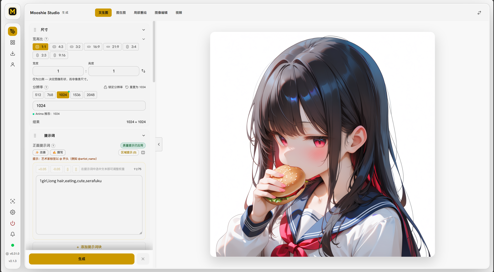
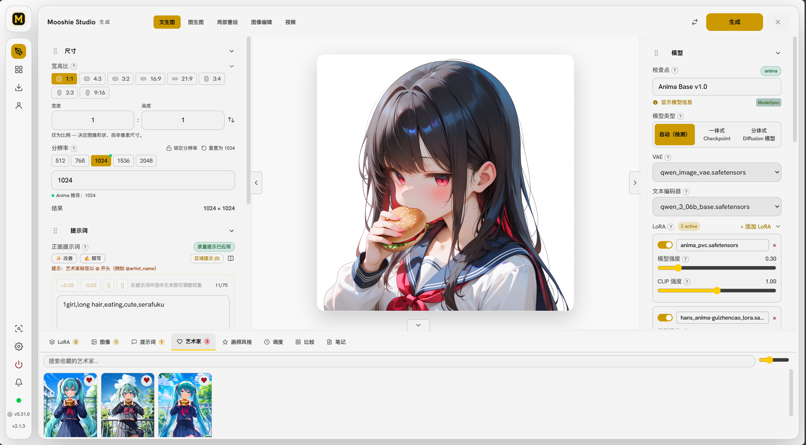

> ## ⚠️ 重要声明 / Important Notice
>
> **中文**：本项目是 [MooshieUI](https://github.com/Mooshieblob1/MooshieUI) 官方项目的**个人二次修改版（fork）**，仅供个人自用，**不提供任何维护与支持**。请勿在官方项目仓库提交 issue、PR 或功能请求，以免打扰官方维护者。所有使用风险（包括但不限于数据丢失、兼容性问题、安全漏洞）均由使用者自行承担。
>
> **English**: This repository is a **personal fork / modified version** of the official [MooshieUI](https://github.com/Mooshieblob1/MooshieUI) project. It is maintained **for personal use only** and is **not actively maintained or supported**. Please **do NOT open issues, PRs, or feature requests** on the official project, so as not to disturb the upstream maintainers. You use this software entirely at your own risk (including but not limited to data loss, compatibility issues, and security vulnerabilities).
# MooshieUI

MooshieUI is a beginner-friendly interface for [ComfyUI](https://github.com/comfyanonymous/ComfyUI) that runs in two modes:
- **Desktop app** via Tauri (Windows/Linux, macOS source build)
- **Browser/server mode** via the built-in web server (LAN/Docker friendly, mobile UI)

Built with **Svelte 5** + **Rust**, it hides ComfyUI's node-graph complexity behind a clean, guided workflow so you can generate without hand-editing graphs.


[](https://github.com/sponsors/Mooshieblob1)

<p align="center">
  
</p>

<p align="center">
  <a href="https://github.com/sponsors/Mooshieblob1">
    
  </a>
</p>

<p align="center">
  <em>MooshieUI is free and open source. If it saves you time or sparks joy, a sponsorship keeps the updates coming. No pressure, just gratitude. 🙏 (<a href="#-support--where-the-money-goes">where does the money go?</a>)</em>
</p>




---

## NewUI Fork Features

NewUI is the redesigned interface variant in this personal fork. It keeps MooshieUI's ComfyUI workflow while focusing on a more flexible workspace, clearer controls, and better touch interaction.

### 主要特色

- **全新 Studio 生成工作区**：提供 Studio Workbench 和 Focus Preview 两种桌面布局，可将生成控制集中到左侧或右侧，并支持左右面板交换。
- **更好的移动端体验**：支持顶部快速面板控制或边缘滑出控制，生成按钮固定在底部操作区，Gallery、Model Hub 和 Settings 也针对小屏幕重新排版。
- **Inpainting Canvas Editor**：在局部重绘时可独立开启 Canvas Editor，快速切换画布、遮罩和生成控制。
- **提示词收藏库**：支持保存、搜索、编辑、删除、分组和导出提示词，并可从历史记录或生成面板直接复用。
- **服务器目录浏览器**：可浏览服务器端目录，使用路径输入、上级目录、前进后退和位置导航选择模型、画廊及自动保存目录。
- **更可靠的模型路径识别**：根据模型实际所在目录判断加载类别，减少 checkpoint 与 split model 切换后的加载错误。
- **更多外观设置**：可选择生成页布局、控制面板位置、移动端面板操作方式和按钮阴影质量。
- **Fork 更新提示**：明确区分 Fork Releases 与官方 MooshieUI 更新，自动更新保持关闭并支持手动下载。

### NewUI highlights

- A redesigned Studio generation workspace with Workbench and Focus Preview layouts.
- Swappable left and right control panels, persistent panel sizing, and a clearer command bar.
- Touch-friendly mobile controls with quick actions, edge handles, and a bottom generation dock.
- A dedicated Canvas Editor toggle for inpainting workflows.
- A prompt library with saved prompts, search, groups, editing, export, and history reuse.
- A server-side directory browser for model, gallery, and save paths.
- More reliable physical model-folder detection for checkpoint and split-model loading.
- Additional appearance preferences for layout, panel controls, and button shadow quality.

NewUI is an unofficial personal fork. Automatic updates are disabled for this build. Download fork builds from the [Fork Releases](https://github.com/cyaeq/MooshieUI-fork/releases) page, and use the [official MooshieUI releases](https://github.com/Mooshieblob1/MooshieUI/releases) for upstream versions.

---

## 📚 Documentation

Full guides live in the **[MooshieUI Wiki](https://github.com/Mooshieblob1/MooshieUI/wiki)**:

| Guide | Covers |
|-------|--------|
| [Installation](https://github.com/Mooshieblob1/MooshieUI/wiki/Installation) | Desktop, Docker, remote/cloud ComfyUI, macOS source build |
| [Generation Basics](https://github.com/Mooshieblob1/MooshieUI/wiki/Generation-Basics) | Modes, generation controls, dimensions |
| [Prompting Guide](https://github.com/Mooshieblob1/MooshieUI/wiki/Prompting-Guide) | Autocomplete, presets, wildcards, interrogation |
| [Prompt Assistant](https://github.com/Mooshieblob1/MooshieUI/wiki/Prompt-Assistant) | LLM-assisted prompt building |
| [Models & the Model Hub](https://github.com/Mooshieblob1/MooshieUI/wiki/Models-and-the-Model-Hub) | Supported architectures, auto-detection, downloads |
| [Upscaling & Face Fix](https://github.com/Mooshieblob1/MooshieUI/wiki/Upscaling-and-Face-Fix) | Tiled diffusion, guidance nodes, face fix |
| [ControlNet & Style Transfer](https://github.com/Mooshieblob1/MooshieUI/wiki/ControlNet-and-Style-Transfer) | ControlNet and reference/style transfer |
| [Inpainting & the Canvas Editor](https://github.com/Mooshieblob1/MooshieUI/wiki/Inpainting-and-the-Canvas-Editor) | Mask painting and selective edits |
| [Compare Grid](https://github.com/Mooshieblob1/MooshieUI/wiki/Compare-Grid) | XYZ parameter sweeps |
| [Gallery & Metadata](https://github.com/Mooshieblob1/MooshieUI/wiki/Gallery-and-Metadata) | Persistent gallery, metadata import/remix |
| [Server, LAN & Multi-User](https://github.com/Mooshieblob1/MooshieUI/wiki/Server,-LAN-and-Multi-User) | Self-hosting, roles, auth, mobile |
| [Settings & Accessibility](https://github.com/Mooshieblob1/MooshieUI/wiki/Settings-and-Accessibility) | Persistence, i18n, accessibility |
| [FAQ](https://github.com/Mooshieblob1/MooshieUI/wiki/FAQ) | Common questions |

---

## ✨ Highlights

- **Three generation modes** - text to image, image to image, and inpainting with a built-in canvas/mask editor; settings carry over between modes.
- **Full generation controls** - searchable checkpoint/VAE/LoRA pickers with auto-download, all ComfyUI samplers and schedulers, steps/CFG/seed/batch, and smart dimension presets.
- **Smart model detection** - 20+ architectures (SD 1.5, SDXL, Illustrious/NoobAI, Pony, SD3/3.5, the Flux family, Chroma, Z-Image, Wan, Qwen, AuraFlow, PixArt, HunyuanDiT, Stable Cascade, Kolors, Anima, Mugen, Nanosaur) identified by SHA256 hash, each with auto-applied sampler/scheduler/CFG presets.
- **Tiled-diffusion upscaling** - MultiDiffusion/SpotDiffusion with anti-hallucination guidance nodes, one-click upscale, and YOLOv8 face fix.
- **Compare Grid (XYZ)** - per-cell parameter sweeps stitched into a single labelled image.
- **Real-time feedback** - live latent previews, progress phases, and cancel, streamed over WebSocket.
- **Gallery & metadata** - persistent SQLite-backed gallery; drag a PNG back in to restore its settings (SwarmUI/A1111 metadata + stealth alpha).
- **Self-hostable** - headless web server with roles, per-user galleries, auth, and a dedicated mobile layout.
- **11 languages** - 2,000+ translation keys with full locale parity, switchable without restart.

See the [Wiki](https://github.com/Mooshieblob1/MooshieUI/wiki) for the full feature reference.

---

## 📦 Quick Start

### Desktop (Windows/Linux)

1. Download a release from [Releases](https://github.com/Mooshieblob1/MooshieUI/releases).
2. Run the app. The setup wizard downloads uv, Python, ComfyUI, and PyTorch (NVIDIA, AMD, or Intel Arc GPU auto-detected) and installs MooshieUI's custom nodes - no Python or pip setup required.
3. Start generating; ComfyUI launches automatically.

> ~5–10 GB disk, 5–15 minutes on first launch. macOS, Docker, and remote/cloud ComfyUI setups are covered in [Installation](https://github.com/Mooshieblob1/MooshieUI/wiki/Installation).

### Self-host (Docker)

```bash
cp .env.example .env   # optional: credentials/ports
docker compose up -d --build
```

Open `http://localhost:3200` (or your configured `MOOSHIEUI_PORT`). Full server/LAN/multi-user setup: [Server, LAN & Multi-User](https://github.com/Mooshieblob1/MooshieUI/wiki/Server,-LAN-and-Multi-User).

### Build from source

```bash
git clone https://github.com/Mooshieblob1/MooshieUI.git
cd MooshieUI
npm install
npm run tauri dev      # hot-reload dev
npm run tauri build    # production build
```

---

## 🏗️ How it works

1. You adjust settings in the Svelte UI.
2. On Generate, settings go to the Rust backend via the IPC bridge (`ipcInvoke()` on desktop, HTTP/SSE in browser mode).
3. Rust builds a ComfyUI workflow JSON from templates - no node graph exposed.
4. The workflow is submitted to ComfyUI's `/prompt` API.
5. WebSocket streams progress and previews back to the UI in real time.

MooshieUI also ships custom ComfyUI nodes (tiled diffusion, soft/smart guidance, an SDXL↔Flux2 VAE adapter, Nanosaur DiT support, and face fix) that are auto-installed into ComfyUI. Details live in [Models & the Model Hub](https://github.com/Mooshieblob1/MooshieUI/wiki/Models-and-the-Model-Hub). The tiled diffusion node is also available as a standalone ComfyUI custom node: [ComfyUI-MooshieTiledDiffusion](https://github.com/Mooshieblob1/ComfyUI-MooshieTiledDiffusion).

---

## 🛠️ Tech Stack

| Layer | Technology |
|-------|------------|
| Frontend | Svelte 5, TypeScript 6, Tailwind CSS 4 |
| Runtime | Tauri desktop app + axum headless web server |
| State | Svelte 5 runes - class-based singleton stores |
| Persistence | Tauri Store (JSON) + SQLite (`rusqlite`) |
| ComfyUI transport | REST + WebSocket via Rust (reqwest, tokio-tungstenite) |
| Inference | ONNX Runtime (`ort`) for WD EVA02 image interrogation |
| Autocomplete | Danbooru + Anima tag databases (~140k tags) |
| i18n | 11 languages, 2,000+ keys, runtime switching |
| Build | Vite 6 + `@sveltejs/vite-plugin-svelte` |

---

## 🔒 Security

Automated **GlassWorm resistance checks** run on every push and pull request to catch supply-chain attacks that hide payloads in invisible Unicode variation selectors or tamper with git timestamps. The CI workflow (`.github/workflows/glassworm-scan.yml`) blocks merges on failure. Contributors should enable the same checks locally:

```bash
bash scripts/setup-hooks.sh
```

---

## 💛 Support & Where the Money Goes

First off, to be clear: **this is not meant to be income.** MooshieUI is a passion project. I build it in my spare time around a regular day job, I don't expect to earn anything from it, and right now the running costs come straight out of my own pocket.

If you [sponsor the project](https://github.com/sponsors/Mooshieblob1), here is exactly where it goes:

- **Domain & hosting** - keeping the project site and download links online.
- **SaaS & dev tooling** - the paid services and tools used to actually build and ship MooshieUI.
- **GitHub Pro+** - CI/CD minutes for the build, release, and security-scan pipelines.

The goal is simply to stop the project from costing me money to keep alive. Anything beyond covering costs just goes right back into building more features, faster.

Longer term, the ideal is that MooshieUI can outlast my own availability. I intend to support this project for as long as I can, but every maintainer has lulls, and life can pull you away for a stretch. A small buffer means the domain, hosting, and infrastructure stay paid up through those quiet periods, so the project stays online and usable even when I am not actively maintaining it.

Sponsoring is completely optional and the app will always be free and open source either way. Thank you for even considering it. 🙏

---

## 🤝 Contributing

Pull requests are welcome. `main` is protected: open a PR from a `chore/<topic>` branch after local validation and GlassWorm pre-commit checks. See **[push-instructions.md](push-instructions.md)** for the full workflow (branch naming, build gates, IPC/gallery conventions, and CI).

---

## 📋 Changelog

See [CHANGELOG.md](CHANGELOG.md) for the full version history.

---

## 📄 License

Licensed under the [GNU Affero General Public License v3.0](LICENSE).

---

## 🙏 Acknowledgments

MooshieUI stands on the shoulders of a huge amount of open-source work. Sincere thanks to every project, researcher, model creator, and service below.

### Core foundations

- **[ComfyUI](https://github.com/comfyanonymous/ComfyUI)** (comfyanonymous) - the diffusion backend that powers all generation. MooshieUI would not exist without it.
- **[Tauri](https://tauri.app/)** - the Rust desktop app framework, plus its store, shell, dialog, fs, clipboard, updater, and process plugins.
- **[Svelte](https://svelte.dev/)**, **[Tailwind CSS](https://tailwindcss.com/)**, **[Vite](https://vite.dev/)**, and **[TypeScript](https://www.typescriptlang.org/)** - the frontend stack.
- **[PyTorch](https://pytorch.org/)** - the ML framework behind ComfyUI inference.
- **[uv](https://github.com/astral-sh/uv)** (Astral) - manages Python and the ComfyUI environment during setup.

### Inference runtimes

- **[llama.cpp](https://github.com/ggml-org/llama.cpp)** (ggml-org) - local LLM inference for the Prompt Assistant.
- **[ONNX Runtime](https://onnxruntime.ai/)** (Microsoft) via the **[ort](https://github.com/pykeio/ort)** Rust crate - runs the image interrogator.
- **[Ultralytics](https://github.com/ultralytics/ultralytics)** - YOLOv8/YOLO11 detection powering Face Fix and segment refinement.

### Bundled third-party ComfyUI nodes

Auto-installed into ComfyUI alongside MooshieUI's own nodes:

- **[comfyui_controlnet_aux](https://github.com/Fannovel16/comfyui_controlnet_aux)** (Fannovel16) - ControlNet preprocessors (Canny, Depth, OpenPose, LineArt, and more).
- **[ComfyUi-Untwisting-RoPE](https://github.com/BigStationW/ComfyUi-Untwisting-RoPE)** and **[ComfyUi-Scale-Image-to-Total-Pixels-Advanced](https://github.com/BigStationW/ComfyUi-Scale-Image-to-Total-Pixels-Advanced)** (BigStationW) - training-free style transfer (the Anima style-transfer workflow is ported from Untwisting-RoPE's examples) and advanced image scaling.

### Research implemented by MooshieUI's own nodes

- **MultiDiffusion** - [Bar-Tal et al., ICML 2023 (arXiv:2302.08113)](https://arxiv.org/abs/2302.08113) - overlapping-tile fusion for tiled diffusion upscaling.
- **SpotDiffusion** - [Frolov et al., 2024 (arXiv:2407.15507)](https://arxiv.org/abs/2407.15507) - seam-free shifted-window tiling.
- **CFG Rescale** - ["Common Diffusion Noise Schedules and Sample Steps are Flawed" (Lin et al., arXiv:2305.08891)](https://arxiv.org/abs/2305.08891) - the basis of MooshieSoftGuidance, plus community "Mahiro"-style positive-biased guidance behind MooshieSmartGuidance.
- **OmniSR** - ["Omni Aggregation Networks for Lightweight Image Super-Resolution" (CVPR 2023, arXiv:2304.10244)](https://arxiv.org/abs/2304.10244) - lightweight super-resolution.

### Models & model creators

- **[WD EVA02 Large Tagger v3](https://huggingface.co/SmilingWolf/wd-eva02-large-tagger-v3)** (SmilingWolf) - image interrogation/tagging.
- **[CLIPSeg](https://huggingface.co/CIDAS/clipseg-rd64-refined)** (CIDAS) - text-prompted region detection for `<segment:...>` refinement.
- **Face detection models** - [Anzhc's YOLOs](https://huggingface.co/Anzhc/Anzhcs_YOLOs) (default face segmentation) and [ADetailer models](https://huggingface.co/Bingsu/adetailer) (Bingsu) for Face Fix.
- **Upscalers** - OmniSR, SPAN, and DAT (IllustrationJaNai) model weights hosted by [Acly](https://huggingface.co/Acly/Omni-SR) and [AshtakaOOf](https://huggingface.co/AshtakaOOf/safetensored-upscalers).
- **Prompt Assistant LLMs** - [Qwen](https://huggingface.co/Qwen) (Alibaba) instruct models and [DanTagGen](https://huggingface.co/KBlueLeaf/DanTagGen-delta) (KBlueLeaf), with GGUF quantizations by [bartowski](https://huggingface.co/bartowski).
- **Supported architectures & recommended models** - [Anima](https://huggingface.co/circlestone-labs/Anima) (Circlestone Labs), [Mugen](https://huggingface.co/CabalResearch/Mugen) (CabalResearch), Nanosaur (whose VAE builds on [Meta's DINOv3](https://github.com/facebookresearch/dinov3) and whose text encoder uses [Google's Gemma 3](https://huggingface.co/google/gemma-3-270m)), [SDXL and its VAE](https://huggingface.co/stabilityai) (Stability AI), and [Juice](https://huggingface.co/Enferlain/juice) (Enferlain).

### Ecosystem compatibility & inspiration

- **[SwarmUI](https://github.com/mcmonkeyprojects/SwarmUI)** - MooshieUI reads and writes SwarmUI-compatible metadata, supports its `<segment>`/`<fromto>` prompt syntax, and borrows its backend-handler and in-memory image delivery patterns.
- **[AUTOMATIC1111 Stable Diffusion WebUI](https://github.com/AUTOMATIC1111/stable-diffusion-webui)** - legacy metadata parsing and the `(tag:1.1)` weight syntax.
- **[InvokeAI](https://github.com/invoke-ai/InvokeAI)** and **[NovelAI](https://novelai.net/)** - additional prompt weight syntaxes MooshieUI understands and converts.
- **[stealth-pnginfo](https://github.com/ashen-sensored/sd_webui_stealth_pnginfo)** (ashen-sensored) - the alpha-channel metadata embedding technique.
- **[ComfyUI Impact Pack](https://github.com/ltdrdata/ComfyUI-Impact-Pack)** (ltdrdata) - the face-detailer concept that MooshieUI's lightweight FaceDetailer node reimplements.

### Data & services

- **[CivitAI](https://civitai.com/)** - model search, hash lookup, and metadata.
- **[Hugging Face](https://huggingface.co/)** - hosting for nearly every model MooshieUI downloads.
- **[Danbooru](https://danbooru.donmai.us/)** and **[Gelbooru](https://gelbooru.com/)** - the tag taxonomies behind autocomplete (~140k tags; Gelbooru-derived Anima list curated by [BetaDoggo](https://huggingface.co/BetaDoggo)).
- **[Animadex](https://animadex.net/)** - the character and LoRA database integration.
- **[Photopea](https://www.photopea.com/)** - the embedded full image editor.
- **GitHub** and **Cloudflare** - code hosting, CI/CD, releases, and the CDN behind the artist gallery.

### Libraries

- **Frontend**: [Konva](https://konvajs.org/) + [svelte-konva](https://github.com/konvajs/svelte-konva) (canvas editor), [marked](https://github.com/markedjs/marked) (markdown), [DOMPurify](https://github.com/cure53/DOMPurify) (sanitization), [SortableJS](https://github.com/SortableJS/Sortable) (drag & drop), and [ntc-ts](https://github.com/Danetag/ntc-ts) (a TypeScript port of [Chirag Mehta's "Name that Color"](https://chir.ag/projects/ntc/)).
- **Rust**: [Tokio](https://tokio.rs/), [axum](https://github.com/tokio-rs/axum), [reqwest](https://github.com/seanmonstar/reqwest), [tokio-tungstenite](https://github.com/snapview/tokio-tungstenite), [rusqlite](https://github.com/rusqlite/rusqlite) + [SQLite](https://sqlite.org/), [jxl-oxide](https://github.com/tirr-c/jxl-oxide) and jxl-encoder ([JPEG XL](https://github.com/libjxl/libjxl) gallery storage), and [RustCrypto's Argon2](https://github.com/RustCrypto/password-hashes) (password hashing).

If your work is used in MooshieUI and you feel it isn't credited properly here, please [open an issue](https://github.com/Mooshieblob1/MooshieUI/issues), it will be fixed promptly.
